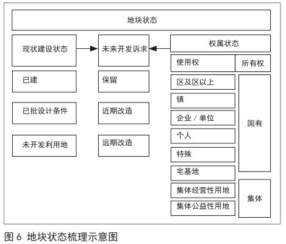
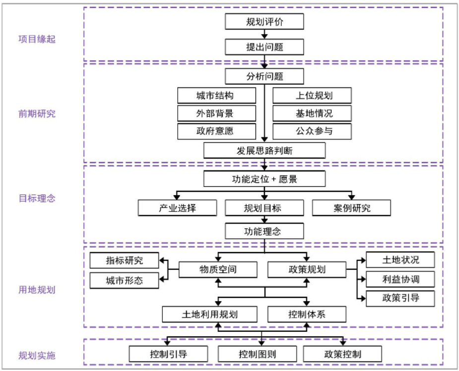
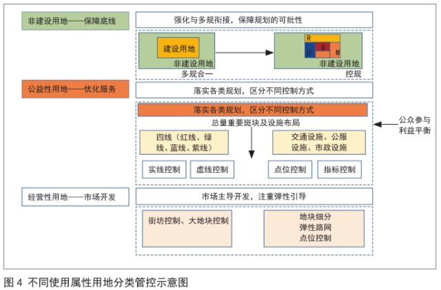

## 存量型控规

### 控规需要解决的问题
1. 城市发展建设中公共利益的保障
2. 明确各利益主体在城市建设和发展中的责、权、利关系
3. 积极通过城市设计手段控制良好的城市空间环境
4. 为土地出让提供依据

[1] 《城市详细规划统一技术措施》

---

### 存量行控规中可能遇到的问题
1. **公共利益难以保障**
   - **涉及公共利益的地块难以形成帕累托改进**：控规单元划分不够合理导致涉及大型公共设施的地块回报较低，大型公共设施难以落地，上位规划难以落实
   - **人均指标难以确定**：指标调整受到现状制约，不同区域指标难以形成统一标准

2. **利益分配难以平衡**
   - **缺乏制衡**：控规的实施必须面对已取得合法使用权的土地业主，涉及政府、市场主体以及公众等多利益主体，而更新改造时往往以利益冲突的形式表现出主体间的多种博弈，控规趋于简洁明了的指标体系表达则无法充分体现公平公正内涵。
   - **交易成本高昂**：对于存量用地而言，土地权属多半已成为既定事实，复杂的土地权属及不同主体的改造意愿不同导致土地流转成本高昂

3. **难以实现有效管控**
   - **控制缺失**：对现状已形成地区，除明确发展诉求用地之外，尤其涉及产权复杂的城中村、老旧住区等，对于地块所在权属类型及权利人考虑较少，常见做法是规划指标维持现状或直接留白，无法形成合理管控。
   - **基础信息复杂**：用地结构类型繁多，需要区分掌握其中复杂多样的结构类型，研判不同类型存量土地的规划依据和调整方向，依据现有行政许可判断各宗地控规调整余地
   - **地块破碎**：存量用地的建设使用分散破碎，造成传统的控规编制方法与相关规定的不适应性。道路交通、配套服务设施、基础设施和公园绿地等城市公共设施难以按照相关技术规定及上位规划要求“落地”，导致以往形成的低水平发展格局长期以来难以改变。
   - **事权划分困难**：已有设施的改造涉及多个部门事权难以协商

4. **无法提供土地交易依据**
   - **规划延误**：编制成果的严肃性与市场开发的多变性存在矛盾，控规输出的静态化控制指标与片区开发产生“时间差”，在后续控规编制修订时，出现“编而不批”等消极现象，使得控规一直处于编制阶段，无法有效发挥法定效力，对土地出让和城市建设造成“规划延误”。

[2] 邹兵.增量规划向存量规划转型:理论解析与实践应对[J].城市规划学刊,2015(05):12-19.DOI:10.16361/j.upf.201505001.
[3] 王嘉.基于多主体利益平衡的深圳市城市更新规划实施机制研究[C].中国城市规划学会、贵阳市人民政府.新常态：传承与变革——2015中国城市规划年会论文集（11规划实施与管理）.
[4] 杜雁.深圳法定图则编制十年历程[J].城市规划学刊,2010(01):104-108.
[5] 陈昌勇，陈静．存量型控规的精细化编制方法探索 — 以佛山市控规编制实践为例[J]．规划师，2018(1)：120-125．
[6] 蔡震.我国控制性详细规划的发展趋势与方向[D].清华大学,2004.
[7] 吕慧芬.控制性详细规划实效性评价分析[D]. 西安建筑科技大学, 2005. P14
[8] 赵燕菁. 城市规划的下一个三十年[J]. 北京规划建设, 2014(01期).

---

### 可能的方法
1. **供需互动**——规划准备期
   - 明确规划范围用地属性，对用地状态进行精细化管理（图）
   - 以供调需，择要发展：进行用地更新潜力分级评估
   - 基于开发容量测算结果，结合控国土空间规划，对片区公共服务数量进行测算

2. **分层编制、分级管控**——片区统筹与上位规划衔接
     - 编制分区规划：建立总体规划与单元规划的“衔接桥梁”、建立政府公众与市场主体的“博弈平台”、引导空间增容与结构优化
     - 

3. **过程运作**——规划编制过程
    - 动态维护
      - 控规编制“自下而上”，通过整合多方需求形成方案
      - 政府强化统筹角色，在协调和平衡各方利益的基础上对开发建设行为进行管控，结合开发建设增加公共服务，确保公共利益不因市场行为受到损害
   - 构建存量共同开发控制体系
     - 对土地进行空间细化再分类，按照已有或新增的资源对存量空间进行再组合，形成共同开发、多方共赢的新发展空间
   - 多元协同
     - 关于底线形成共识：构建交流平台，在理清各层级政府和各方权限的基础上，通过专项报告的方式，明确需要共同遵守的刚性控制内容
     - 规划过程中调整各方利益：协作式规划
       - 搭建多元主体协作平台，明确“规划引领，契约协作”的协作关系
       - 加强沟通协作，弱化政府的强制性管理 ，充分调动市场与社会的积极性
       - 强调多视角的切入，目标与问题双重导向统筹结合，制定有针对性的规划方案
       - 注重连续、渐进式的过程研究，有序推进规划实施

1. **精细化管控**——规划管控方法
   - "用地功能置换"转变为"建设容量功能置换"，通过容积率调整（奖励、转移等）实现利益平衡
   - 基于土地的使用属性的分类管控（图）
     - 区分建设与非建设用地的管控边界
     - 区分公益性用地和经营性用地
     - 区分村庄用地和城市用地
     - 区分用地性质改变与否、用地上是否进行重新建设
     - 内容明确的刚性控制、处于动态变化状态的预留弹性
   - 引导地块改造和公共服务配套的提升
     - 对改造方向明确的地块，在不变更产权的情况下，通过补偿容积率和增加公共空间的平衡方式鼓励用地改造
     - 改造方向不确定的用地尝试增加“两可用地性质”
     - 满足总量控制要求的前提下，尊重现状产权和业主诉求，对地块进行细分组合

5. **降低规划实施的交易成本，提高各方利益**——推进方案
   - 同类用地竞争力平衡、形成连贯的空间体验
   - 以宅基地地租为基础分配宅基地权益
   - 削弱村集体在土地使用中的调节作用，形成与市场推动的城市化相适应的“城市和村民两方利益”，促进村民向市民转变，避免拆旧村建新村的情况

[5] 陈昌勇，陈静．存量型控规的精细化编制方法探索 — 以佛山市控规编制实践为例[J]．规划师，2018(1)：120-125
[x] 袁媛，陈金城. 协作式规划在控制性详细规划中的应用研究
[x] 夏林茂.北京市控规调整中的技术与政治性因素分析
[x] 王波.浅谈城乡规划编制中的可操作性问题，科技咨询导报, 2007年28期