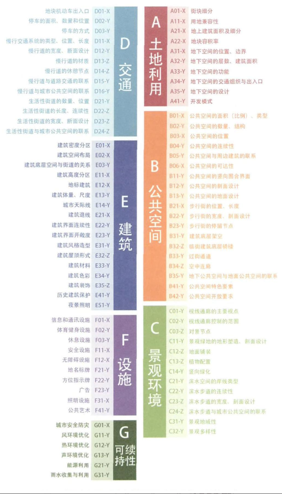

# 存量型控制性详细规划
**前提：更新改造/重大项目置入**
**目的：指导城市建设、为土地出让提供依据、平衡各方利益**

## 问题：
1. 已有存量规划主要通过增量规划带来的空间收益反哺旧城，推动旧城用地置换和功能升级（异地空间置换模式），当增量受到严重限制后，存量规划如何推动？
   - 如何获得更高的空间增殖收益？
   - 非帕累托改进下如何对利益受损这形成合理补偿？
2. 存量土地上的违法建设问题如何在新的规划中得以解决？
3. 批而未建之类低效利用土地如何在新的规划中得以消化？
4. 设计适合旧城区的成本最低的空间交易方式？（与增量规划不同，存量规划制订过程中涉及交易成本较高，政府方面临角色转变，成为不同交易主体之间的仲裁者，因此规则的制订比空间用途划定更为重要）

## 判断：
**是否改变用地性质（若改变，变成何种性质？）、是否重建（若重建，如何进行空间控制？）**
- 变性质不重建：政策改造
- 变性质重建：空间改造
- 不变性质不重建：维持现状
- 不变性质重建：缺乏动力的更新

## 技术路线
- **问题导向：项目缘起、前期分析、目标理念、规划衔接、规划实施**
  
  ### 项目缘起：分析上位规划+背景
    - 划对既有空间结构、主导功能的调整
      - 上位规划要求
      - 城市格局
  ### 前期分析：规划结构
    - 周边环境
    - 各方意愿
      - 政府需求、企业需求、公众需求
    - 资源禀赋
  ### 目标理念：规划目标和策略
    - 目标
      - 厘清政府主导的公共事务和非政府组织或个体主导的经营性事务
      - **完善土地二级市场，留下灵活的调整空间使土地供给适应市场土地需求**
      - 落实上层规划的管控内容：生态保护红线、城镇开发边界、市区级五线等
      - 体现本级事权：城市品质设施、风貌管控等
    - 策略
      - 清单化管理
  ### 方案和控制体系
    - **权属关系梳理**
    - **产权使用评价（难易程度）**
  ### 规划实施
    - 管控体系（代表性的管控体系包括北京、上海、南京、深圳四城各自技术管控体系）
      - 土地利用
      - 公共空间
      - 景观环境
      - 交通
      - 建筑
      - 设施
      - 可持续性
    

## 利益平衡
- 工业改造
  - 政策改造中，同类用地竞争力平衡（对竞争力强的用地增加公共服务负担提高其使用成本）
  - 空间改造中，整体回收集中建设，形成连贯的空间体验
- 城中村改造
  - 按城市服务标准重新配套城中村服务体系
  - 削弱村集体在土地使用中的调节作用，形成与市场推动的城市化相适应的“城市和村民两方利益”，促进村民向市民转变，避免拆旧村建新村的情况
  - 以宅基地地租为基础分配宅基地权益
